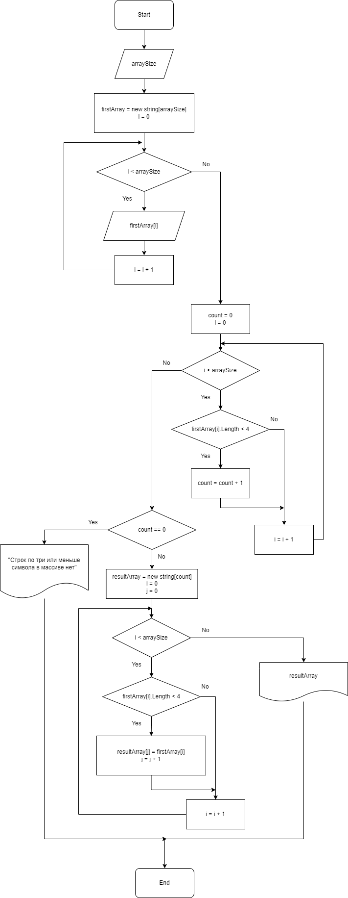

# Контрольная работа

Поставлена задача:
```
Написать программу, которая из имеющегося массива строк формирует новый массив из строк, длина которых меньше, либо равна 3 символам. Первоначальный массив можно ввести с клавиатуры, либо задать на старте выполнения алгоритма. При решении не рекомендуется пользоваться коллекциями, лучше обойтись исключительно массивами.
```
# Алгоритм
Решение данной задачи можно разложить на следующие шаги:
 1. Запрос пользователю на ввод размера массива.
 2. Формирование пустого массива данного размера.
 3. Запрос пользователю на заполнение элементов массива произвольными строками.
 4. Подсчёт элементов текущего массива чья длинна меньше либо равно 3 символам.
 5. Если такой подсчёт выдал 0, то сообщаем о невозможности найти такие символы и завершаем программу.
 6. Создание нового пустого массива с подсчитанным ранее количеством элементов.
 7. Перенос в новый массив элементов с длинной меньше или равно 3 символам.
 8. Печать первоначального массива для визуального контроля.
 9. Печать результирующего массива.

 Можно представить это в виде следующей блок-схемы:
 